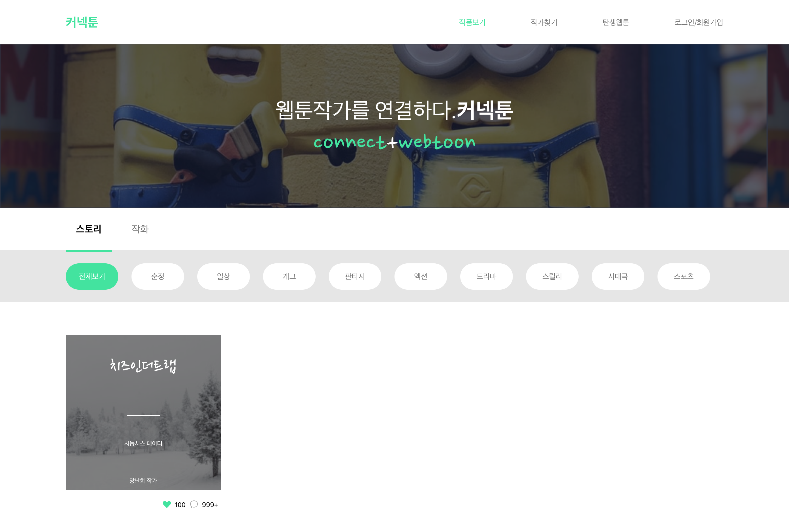
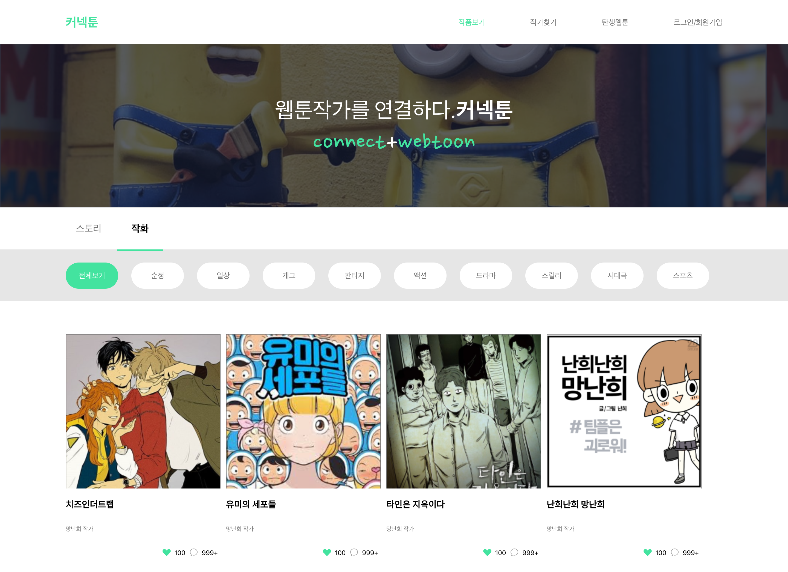
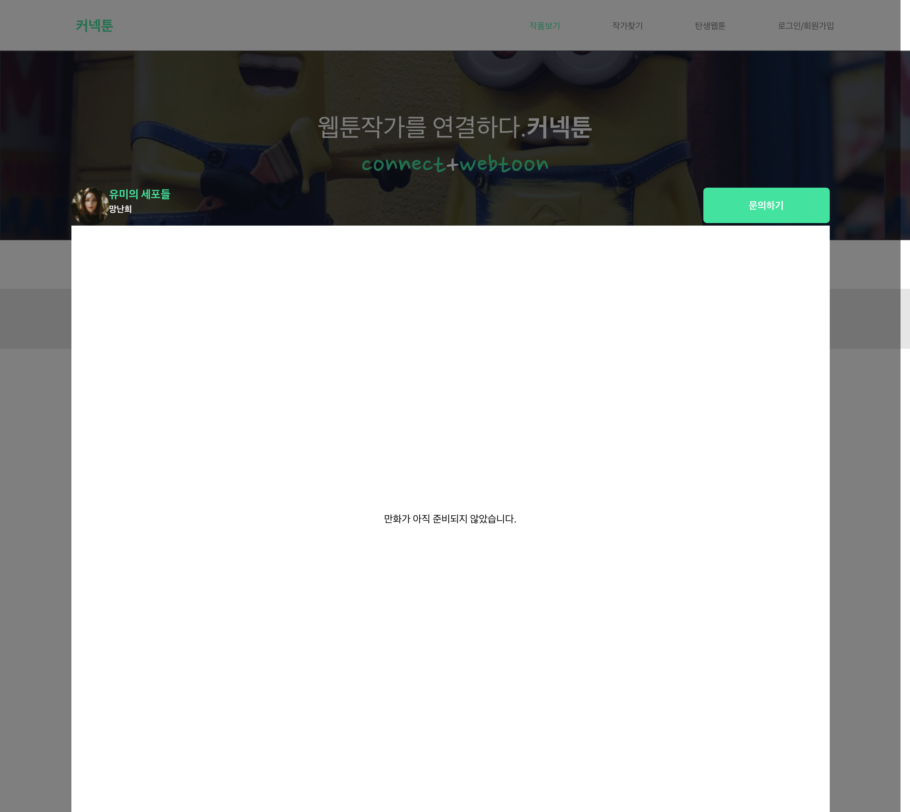

# Connectoon Frontend

Connectoon BackEnd - [Connectoon-BackEnd](https://github.com/cdbrouk/connectoon-backend)

# Stack

- React
- Typescript
- styled-components
- Redux
- typesafe-actions
- Axios

## Todo List

- [x] MainPage ( Header + Banner)
- [x] WebtoonPage ( List of Webtoons )
- [x] Modal Page ( Details of the Webtoon)
- [ ] Empty Page ( Login, Search Author, New Webtoon )
- [ ] Loading Page

## 기록사항

- 우상단 페이지 라우팅 반영 (없는 페이지 구현 안됨)
- 스토리, 작화 및 하위 태그 별 검색 반영
- axios 관련 부분 backend에 post 요청 시 options로 method가 변하는 문제 -> Python 서버 CORS 적용
- modal component 관련 modal 뒤의 투명한 흑색 background 높이가 짧은 문제 -> Scorll Height 구해서 지정하긴 했는데 방식이 맞는지는 모르겠음.

## 결과화면

### 스토리 검색 화면

### 작화 검색 화면

### 상세보기 화면

### 상세보기 화면 (만화없음)

## [Go to Notion](https://www.notion.so/Connectoon-ec2ffbe9174e449a9c847b3c95513a41)
